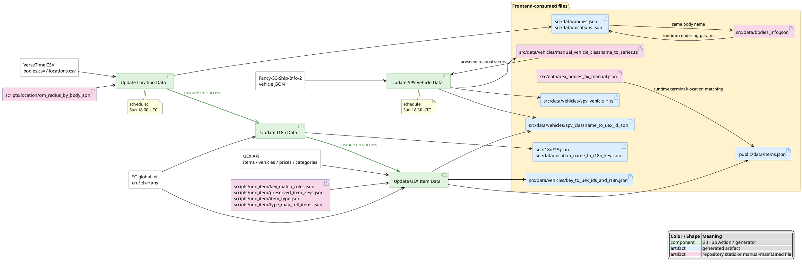

# 数据流总览

本文档说明当前应用使用的生成数据：数据从哪里来、最终提交哪些运行时产物，以及这些产物如何由上游数据匹配生成。

## 总图

## 1. 数据源

- UEX API
  - 来源类型：外部 API。
  - 主要用途：物品 id、物品价格、载具购买 id、分类、物品 metadata、物品 attributes、slug、截图、运行时交易数据。
  - 管理 workflow：`.github/workflows/update-uex-item-data.yml`。
  - 触发条件：手动 `workflow_dispatch`；或 `Update I18n Data` 成功完成后自动触发。
  - 备注：价格和 terminal 数据仍由浏览器运行时通过缓存层拉取，不作为静态 JSON 提交。

- Star Citizen `global.ini`
  - 来源类型：外部静态文件。
  - 下载地址：`https://sczh.42kit.com/orginal/global.ini` 和 `https://sczh.42kit.com/full/global.ini`。
  - 主要用途：item、vehicle、vehicle class、location 翻译；也用于把 UEX 名称匹配回游戏内 canonical i18n key。
  - 管理 workflow：`.github/workflows/update-i18n-data.yml`。
  - 触发条件：手动 `workflow_dispatch`；或 `Update Location Data` 成功完成后自动触发。

- VerseTime CSV
  - 来源类型：其他仓库。
  - 来源仓库：`dydrmr/VerseTime` 的 `data/bodies.csv` 和 `data/locations.csv`。
  - 主要用途：星体和地点的坐标、层级、旋转/轨道字段、wiki 链接和 location flag。
  - 管理 workflow：`.github/workflows/update-location-data.yml`。
  - 触发条件：手动 `workflow_dispatch`；或每周日 `18:00 UTC` 定时触发。

- Fancy-SC-Ship-Info-2 vehicle JSON
  - 来源类型：其他仓库。
  - 来源仓库：`GrakePch/Fancy-SC-Ship-Info-2/main/src/data`。
  - 主要用途：SPV 载具主列表、载具索引、hardpoint 数据。
  - 管理 workflow：`.github/workflows/update-spv-vehicle-data.yml`。
  - 触发条件：手动 `workflow_dispatch`；或每周日 `18:30 UTC` 定时触发。

- 本地静态辅助文件
  - `scripts/uex_item/key_match_rules.json`：手工 item/vehicle 名称匹配规则。
  - `scripts/uex_item/preserved_item_keys.json`：没有当前 UEX id 时仍明确保留的 item key。
  - `scripts/uex_item/item_type.json`、`scripts/uex_item/type_map_full_items.json`：生成 item catalog 时的 type/sub_type fallback。
  - `scripts/location/om_radius_by_body.json`：VerseTime 未提供 `omRadius` 时按 body `name` 补值。
  - `src/data/bodies_info.json`：人工填写的 body 渲染参数，按 body `name` 与生成的 `bodies.json` 对齐。
  - `src/data/uex_bodies_fix_manual.json`：运行时 terminal/location 匹配使用的 body/orbit 名称修正。

## 2. 最终产物

### item

- `public/data/items.json`
  - 类型：list。
  - 主要查找入口：`key`，即游戏/i18n canonical key。
  - 主要 value：`ids`、`type`、`sub_type`、`slug`、`screenshot`、`attributes`。
  - 不包含展示名称；展示名称通过 `src/i18n/items/{en,zh}.json` 按同一个 `key` 查询。
  - 运行时由 `src/App.tsx` 调用 `fetchAndProcessItems()` 加载；处理后的 `dictItems` 写入 `ContextAllData`，供搜索页、详情页、分组详情页和 terminal item 列表复用。

- 运行时 item price 数据
  - 类型：UEX API payload，浏览器缓存。
  - 主要查找入口：`public/data/items.json` 中的 `ids`，对应 UEX item id。
  - 主要用途：运行时生成交易 `options` 和价格 min/max。
  - `price_min_max` 从 `options` 计算；计算时会忽略 4.0 时间点以前的旧价格。
  - item 详情页中的交易地点路径依赖 UEX `terminals` 运行时接口，以及本地 `bodies.json`、`locations.json`、`uex_bodies_fix_manual.json`、`location_name_to_i18n_key.json`。

### vehicle

- `src/data/vehicles/spv_vehicle_list.ts`
  - 类型：list。
  - 主要查找入口：`ClassName`。
  - 主要用途：完整 SPV 载具数据。
  - 覆盖范围：仅包含已交付载具。

- `src/data/vehicles/spv_vehicle_index.ts`
  - 类型：list。
  - 主要查找入口：`ClassName`。
  - 主要用途：较轻量的 SPV 载具索引/基础信息。
  - 覆盖范围：包含未交付载具，因此条目多于 `spv_vehicle_list.ts`。

- `src/data/vehicles/spv_vehicle_hardpoints.ts`
  - 类型：list。
  - 主要查找入口：`ClassName`。
  - 主要用途：SPV hardpoint 数据。

- `src/data/vehicles/manual_vehicle_classname_to_series.ts`
  - 类型：object。
  - key：SPV `ClassName`。
  - value：人工维护的 series 字符串。
  - 生产关系：它会被 `Update SPV Vehicle Data` 读取以保留人工值，同时也是该 workflow 更新后的提交产物。

- `src/data/vehicles/key_to_uex_ids_and_i18n.json`
  - 类型：object。
  - key：vehicle i18n key，例如 `vehicle_NameAEGS_Avenger_Titan`。
  - value：`uex_ids`、`en`、`zh_Hans`。

- `src/data/vehicles/spv_classname_to_uex_id.json`
  - 类型：object。
  - key：SPV `ClassName`。
  - value：数字 UEX vehicle id。

### location

- `src/data/bodies.json`
  - 类型：list。
  - 主要查找入口：`name`。
  - 主要 value：`type`、parent 字段、坐标、radius/orbit/rotation 字段，以及可选 theme color 字段。

- `src/data/locations.json`
  - 类型：list。
  - 主要查找入口：`name`。
  - 主要 value：`type`、parent 字段、坐标、`wikiLink`、`private`、`quantum`。

- `src/data/location_name_to_i18n_key.json`
  - 类型：object。
  - key：英文 location 展示名。
  - value：location i18n key。
  - 主要用途：运行时把地点名解析到翻译 key。

### i18n

- `src/i18n/items/{en,zh}.json`
  - 类型：object。
  - key：item i18n key。
  - value：本地化 item 名称。

- `src/i18n/vehicles/{en,zh}.json`
  - 类型：object。
  - key：vehicle i18n key。
  - value：本地化 vehicle 名称。

- `src/i18n/vehicle_classes/{en,zh}.json`
  - 类型：object。
  - key：vehicle class i18n key。
  - value：本地化 vehicle class 名称。

- `src/i18n/locations/{en,zh}.json`
  - 类型：object。
  - key：location i18n key。
  - value：本地化 location 名称。

- `src/i18n/{en,zh}.json`
  - 类型：object。
  - key：应用 UI translation key。
  - value：静态 UI 文案、筛选器、单位和非生成界面文本。

## 3. 最终产物的生产路径

### item catalog

- `scripts/uex_item/update_key_to_uex_id.py`
  - 上游：UEX `items_prices_all`、UEX `categories?type=item`、英文 `global.ini`、`key_match_rules.json`、`preserved_item_keys.json`。
  - 匹配方式：用 UEX `item_name` 匹配 `global.ini` 中的 item key；先精确名称，再 normalized 名称；候选结果再按 key prefix、category heuristic、manual rule 评分。
  - 输出：CI 中的临时 `$RUNNER_TEMP/itemkey_id.json`；本地默认是 `.tmp/uex_item/itemkey_id.json`。

- `scripts/uex_item/update_items_uex.json.py`
  - 上游：临时 item key map、UEX `categories`、UEX `items`、UEX `items_attributes`、现有 `public/data/items.json`、`item_type.json`、`type_map_full_items.json`。
  - 匹配方式：以 canonical item key 建 catalog；UEX metadata 通过 `ids` 中第一个 UEX id join。
  - fallback：保留已有 screenshot/attributes；当 UEX metadata 缺 type/sub_type 时用旧类型映射补齐。
  - 输出：`public/data/items.json`。

### vehicle data

- `scripts/vehicle/update_spv_vehicle_data.mjs`
  - 上游：Fancy-SC-Ship-Info-2 vehicle JSON、现有 `manual_vehicle_classname_to_series.ts`。
  - 匹配方式：源数据以 `ClassName` 为主键；manual series 用精确 `ClassName` 和大小写不敏感 `ClassName` 保留旧值。
  - 输出：`spv_vehicle_list.ts`、`spv_vehicle_index.ts`、`spv_vehicle_hardpoints.ts`、`manual_vehicle_classname_to_series.ts`。

- `scripts/uex_item/update_key_to_uex_id.py`
  - 上游：UEX `vehicles_purchases_prices_all`、英文 `global.ini`、`key_match_rules.json` 中的 vehicle rules。
  - 匹配方式：用 UEX `vehicle_name` 匹配 `vehicle_Name*` key；先精确名称，再 normalized 名称；优先非 `_short` key。
  - 输出：CI 中的临时 `$RUNNER_TEMP/vehiclekey_id.json`；本地默认是 `.tmp/uex_item/vehiclekey_id.json`。

- `scripts/uex_item/update_vehicle_key_to_uex_ids_and_i18n.py`
  - 上游：临时 vehicle key map、`src/i18n/vehicles/{en,zh}.json`。
  - 匹配方式：按 vehicle i18n key 直接查翻译。
  - 输出：`src/data/vehicles/key_to_uex_ids_and_i18n.json`。

- `scripts/uex_item/update_spv_classname_to_uex_id.mjs`
  - 上游：`spv_vehicle_list.ts`、`key_to_uex_ids_and_i18n.json`。
  - 匹配方式：把 `vehicle_Name*` key 转成候选 `ClassName`，应用已知例外映射，然后只保留存在于 SPV `ClassName` 集合中的项。
  - 输出：`src/data/vehicles/spv_classname_to_uex_id.json`。

### location data

- `scripts/location/update_location_data.py`
  - 上游：VerseTime `bodies.csv`、VerseTime `locations.csv`、`scripts/location/om_radius_by_body.json`。
  - 匹配方式：按 CSV 行字段直接规范化；`omRadius` 在 VerseTime 缺值时按 body `name` 补齐。
  - 输出：`src/data/bodies.json`、`src/data/locations.json`。

- 运行时 terminal/location 匹配
  - 上游：UEX terminal 数据、生成的 body/location JSON、`uex_bodies_fix_manual.json`、`location_name_to_i18n_key.json`。
  - 匹配方式：先修正 UEX body/orbit/location 名称，再和本地 body/location 名称匹配；能匹配时继续映射到 i18n key。
  - 输出：不提交为生成文件，只用于浏览器状态、item 交易地点路径展示和距离计算。

### i18n data

- `scripts/i18n/process_ini_items.py`
  - 上游：英文和简中 `global.ini`。
  - 匹配方式：保留 `item_Name`、`item_name`、`item_decoration`、`item_Mining` 等 item 前缀；排除描述 key。
  - 输出：`src/i18n/items/{en,zh}.json`。

- `scripts/i18n/process_ini_vehicles.py`
  - 上游：英文和简中 `global.ini`。
  - 匹配方式：保留 `vehicle_Name*` key；排除 `_short` key。
  - 输出：`src/i18n/vehicles/{en,zh}.json`。

- `scripts/i18n/process_ini_vehicles_class.py`
  - 上游：英文和简中 `global.ini`。
  - 匹配方式：从 INI 中保留 vehicle class 翻译 key。
  - 输出：`src/i18n/vehicle_classes/{en,zh}.json`。

- `scripts/i18n/process_ini_locations.py`
  - 上游：英文和简中 `global.ini`、脚本内 manual location 翻译、现有 `location_name_to_i18n_key.json`。
  - 匹配方式：保留 `Stanton`、`Pyro`、`RR`、`shop_name`、`area`、`ui_dest`、`Orison_Destination` 等 location 前缀；唯一英文名会追加到 name-to-key map。
  - 输出：`src/i18n/locations/{en,zh}.json`、`src/data/location_name_to_i18n_key.json`。

## Workflow 串联关系

- `Update Location Data`
  - 手动或每周定时触发。
  - 生成 location 静态 JSON。

- `Update I18n Data`
  - 手动或在 `Update Location Data` 成功后触发。
  - 生成 i18n JSON 和 `location_name_to_i18n_key.json`。

- `Update UEX Item Data`
  - 手动或在 `Update I18n Data` 成功后触发。
  - 生成 item catalog 和 UEX vehicle lookup 产物。

- `Update SPV Vehicle Data`
  - 手动或每周定时触发。
  - 生成 SPV vehicle TS 数据，并刷新 SPV `ClassName` 到 UEX id 的映射。
